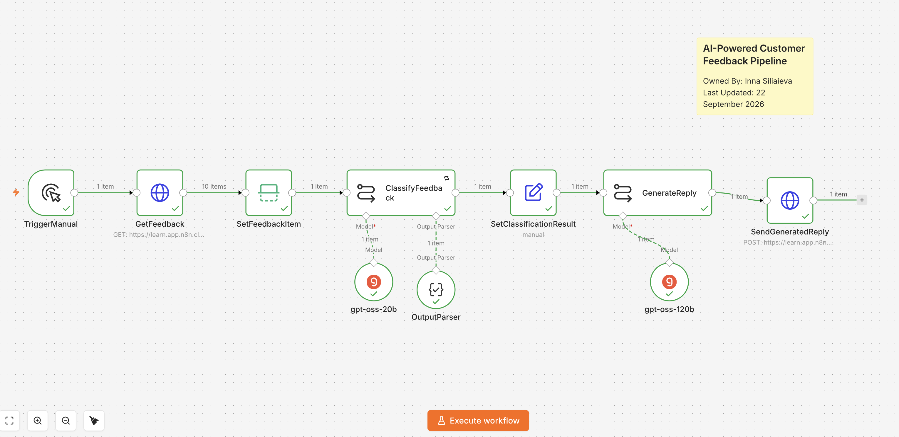
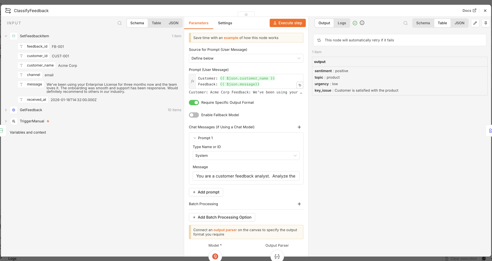
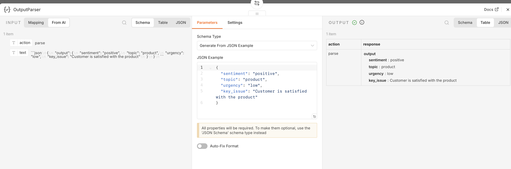
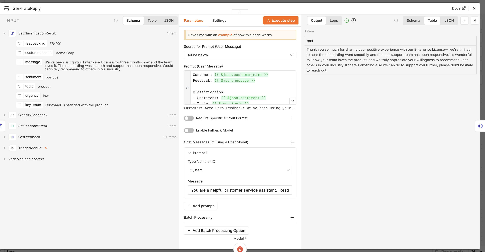
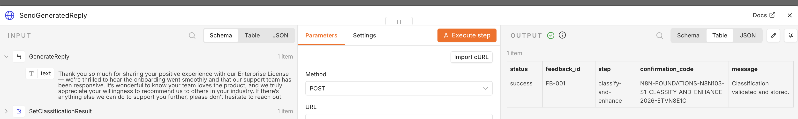
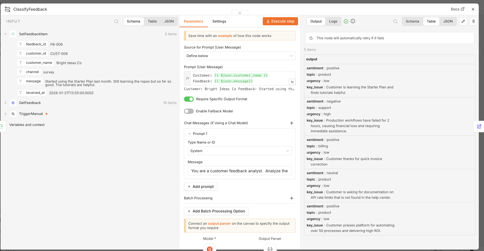

# AI-Powered Customer Feedback Pipeline

An n8n AI workflow that retrieves customer feedback, classifies it into structured categories, generates a context-aware customer reply, and sends the result to an external endpoint.

This project was built as a hands-on exercise in the **n8n Academy N8N103 course** to practice combining traditional workflow automation with AI nodes.

## Project Overview

The workflow demonstrates how AI can be used in a practical business automation pipeline:

1. Retrieve customer feedback from an API.
2. Select one feedback item for processing.
3. Classify the feedback by sentiment, topic, urgency, and key issue.
4. Convert the AI result into a reliable structured JSON format.
5. Prepare the classification data for downstream processing.
6. Generate a personalized reply based on the classification.
7. Send the generated result to the Academy endpoint.

## Workflow

```text
TriggerManual
   ↓
GetFeedback
   ↓
SetFeedbackItem
   ↓
ClassifyFeedback
   ├── Groq model: gpt-oss-20b
   └── Structured Output Parser
   ↓
SetClassificationResult
   ↓
GenerateReply
   └── Groq model: gpt-oss-120b
   ↓
SendGeneratedReply
```

## Main Components

### TriggerManual
Starts the workflow manually for testing.

### GetFeedback
Uses an HTTP Request node to retrieve customer feedback from the n8n Academy API.

### SetFeedbackItem
Limits the incoming dataset so that one feedback item is processed during the final workflow run.

### ClassifyFeedback
Uses a Basic LLM Chain with a smaller Groq model to classify the customer message.

The AI returns four fields:

- `sentiment` — positive, neutral, or negative
- `topic` — billing, product, support, or general
- `urgency` — low, medium, or high
- `key_issue` — a one-sentence summary of the main issue or praise

### OutputParser
Uses a Structured Output Parser to ensure the classification is returned in a predictable JSON structure.

Example:

```json
{
  "sentiment": "positive",
  "topic": "product",
  "urgency": "low",
  "key_issue": "Customer is satisfied with the product"
}
```

### SetClassificationResult
Prepares the original customer data together with the AI classification for the next step.

### GenerateReply
Uses a larger Groq model to generate a short customer-service response.

The response is adapted to the classification:

- negative sentiment / high urgency → empathetic and apologetic tone
- positive sentiment → appreciative and warm tone
- billing / support topic → includes clearer next steps

### SendGeneratedReply
Sends the final result to the n8n Academy endpoint and returns a success confirmation.

## AI Models

This workflow uses two models for different tasks:

- **openai/gpt-oss-20b** — feedback classification
- **openai/gpt-oss-120b** — customer reply generation

Using a smaller model for classification and a larger model for generation demonstrates a common AI workflow pattern: use the right model for the complexity of each task.

## Reliability

The workflow includes several reliability techniques:

- Structured Output Parser for consistent JSON
- explicit output requirements in the system prompt
- retry-on-failure configuration for AI classification
- fixed classification categories
- separation of classification and generation into two AI steps

## Technologies

- n8n
- Groq API
- Basic LLM Chain
- Structured Output Parser
- HTTP Request
- Edit Fields
- JSON
- API authentication
- Prompt engineering

## Screenshots

### 1. Complete workflow



### 2. AI classification output



### 3. Structured Output Parser



### 4. Generated customer reply



### 5. Successful API response



### 6. Classification of multiple feedback items



## Example Result

A feedback message can be transformed from unstructured text into structured data:

```text
Customer feedback
      ↓
AI classification
      ↓
sentiment: positive
topic: product
urgency: low
key_issue: Customer is satisfied with the product
      ↓
AI-generated customer reply
```

## What I Practiced

Through this project I practiced:

- configuring API authentication in n8n
- connecting an external AI provider
- building Basic LLM Chains
- writing system and user prompts
- using expressions to pass data between nodes
- creating structured AI outputs
- parsing and validating JSON
- using different AI models for different tasks
- configuring retries for AI nodes
- chaining AI outputs between workflow steps
- testing and debugging AI workflows

## Security

Credentials and API keys are **not included** in this repository.

After importing the workflow, users must configure their own:

- n8n Academy API credential
- Groq API credential
- required assessment or endpoint headers

## Importing the Workflow

1. Download the workflow JSON file from this repository.
2. Open n8n.
3. Create a new workflow.
4. Choose **Import from File**.
5. Select `ai-customer-feedback-pipeline.json`.
6. Configure your own credentials.
7. Test each node before running the full workflow.

## Repository Structure

```text
AI-Customer-Feedback-Pipeline/
│
├── ai-customer-feedback-pipeline.json
├── README.md
└── screenshots/
    ├── 01-feedback-pipeline-workflow-success.png
    ├── 02-ai-classification-output.png
    ├── 03-structured-output-parser.png
    ├── 04-generated-reply.png
    ├── 05-success-response.png
    └── 06-multiple-feedback-classification.png
```

## Course Context

Built as part of the **n8n Academy N8N103 AI workflow training**.

The project demonstrates a practical foundation for AI-powered business automation: combining API data, structured classification, LLM generation, output validation, and workflow orchestration in n8n.
